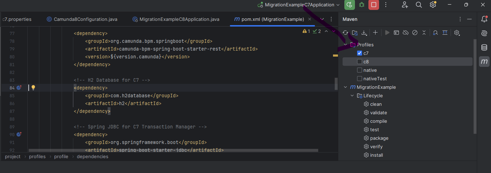

# Camunda 7 to 8 Migration Exercise

This exercise is designed to help you understand the migration process from Camunda BPM 7 to Camunda Platform 8. 
The goals of this exercise are:
- To learn how process models can be migrated from Camunda 7 to 8.
- To understand how code changes need to be adjusted for compatibility with Camunda 8.
- To explore how adapter code can facilitate quicker migrations by bridging the gap between the two versions.

By completing this exercise, you will gain practical experience with the migration tooling provided by the Camunda Community.

## Requirements

- Java (preferable JDK >=21)
- Maven (if the project uses Maven)
- Git (to clone repositories)
- Docker
  - Migration Tooling can be executed in Docker
  - Tests of Community project are utilizing a Camunda 8 engine running in Docker
- Camunda 8 SaaS or SM
## Exercise Steps

### Step 1: Install Docker

Ensure Docker is installed on your system. It will be utilized by the migration tooling for running tests in a containerized environment.

### Step 2: Clone the Migration Tool Repository

Clone the Camunda 7 to 8 migration tool repository using Git:

```bash
git clone https://github.com/camunda-community-hub/camunda-7-to-8-migration.git
cd camunda-7-to-8-migration
```
### Step 3: Diagram Converter Tool
This section focuses on running the Diagram Converter Tooling.
The tool itself comes with a CLI and WebApp version.
Today, we will be focusing on the WebApp edition:
#### Step 3a: Run the Diagram Converter Tool Locally
Run the Diagram Converter Tool locally using Docker:

```bash
docker run --name diagram-converter -p 8080:8080 ghcr.io/camunda-community-hub/camunda-7-to-8-migration/diagram-converter:latest
```

After running the command, you can access the tool at http://localhost:8080.

#### Step 3b: Use the Hosted Version of the Diagram Converter Tool
Alternatively, you can use the hosted version of the Diagram Converter Tool. 
Access it through this URL: @todo ASK DOMENICO for link

### Step 4: Import Project into your IDE
The goal of this step is to ensure that your Camunda 8 projects are correctly configured to work with the Camunda Adapter.
In a Camunda 7 project, the interface JavaDelegate is used to execute custom business logic during process execution.
For projects migrating to Camunda 8, it's important to refactor this interface following JobWorker implementation or utilize the Camunda 7 adapter as a quick win.
This projects contains an example working both with Camunda 7 and Camunda 8.

Pleasure ensure to correctly set the maven profile correspondingly:
See example here:


Steps:
1. Import the project into your favorite IDE and build it

### Step 4a: Run Camunda 7 profile
Ensure that the correct maven profile has been selected and that the correct application-properties is being utilized (c7).
Also make sure that port 8080 is available or change it in application-c7.properties.

Start the application and access the running processes under localhost:8080

### Step 4b: Run Camunda 8 profile
Create new Camunda 8 secrets, preferable in Camunda 8 SaaS console, and copy and overwrite application-c8.properties.
Change application.properties to c8 and change the maven profile to c8.
Build the project afterward and start it.

Observe how JavaDelegates are being picked up the Adapter.

Play around and have fun!

